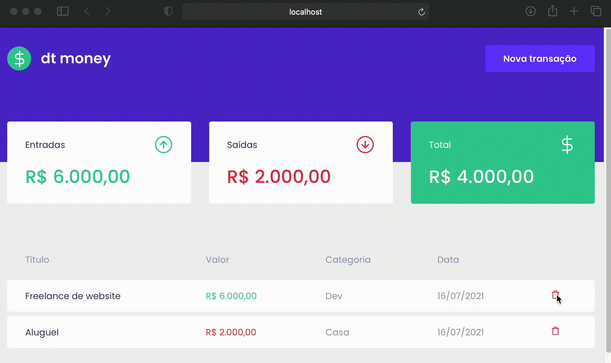

<h1 align="center">
  
</h1>

  <a href="#-tecnologias">Tecnologias</a>&nbsp;&nbsp;&nbsp;|&nbsp;&nbsp;&nbsp;
  <a href="#-projeto">Projeto</a>&nbsp;&nbsp;&nbsp;|&nbsp;&nbsp;&nbsp;
  <a href="#-solução">Solução</a>&nbsp;&nbsp;&nbsp;|&nbsp;&nbsp;&nbsp;
  <a href="#-como-executar">Como executar</a>&nbsp;&nbsp;&nbsp;|&nbsp;&nbsp;&nbsp;
  <a href="#-licença">Licença</a>

  

 

 

## ✨ Tecnologias

Esse projeto foi desenvolvido com as seguintes tecnologias:

- [ReactJS](https://reactjs.org)
- [TypeScript](https://www.typescriptlang.org/)
- [Styled Components](https://styled-components.com)
- [MirageJS](https://miragejs.com)

## 💻 Projeto

O dt money é uma aplicação que permite cadastrar transações financeiras para ter o controle do saldo do usuário.

## 💡 Solução

Nessa aplicação foram explorados vários conceitos importantes do React como: uso de hooks, styled componentes, lift state e API context.
Além de tudo isso, eu adicionei algumas melhorias ao projeto inicialmente proposto durante o Ignite:

- [x] Configuração do editorconfig e prettier do projeto.
- [x] Mudança no layout para deixar o texto do sumário de uma cor que evidencie melhor se o valor é despesa ou entrada, além do saldo final que pode ser positivo ou negativo e por isso deveria ser exibido na cor adequada
- [x] Máscara de formatação no cadastro da transação utilizando o [react-number-format](https://github.com/s-yadav/react-number-format)
- [x] Correção de problema de bordas nas linhas da tabela
- [x] Funcionalidade de remover uma transação cadastrada
- [x] Mensagem de nenhuma transação cadastrada
- [x] Validação de dados obrigatórios

## 🚀 Como executar

- Clone o repositório
- Instale as dependências com `yarn`
- Inicie o servidor com `yarn dev`

Agora você pode acessar [`localhost:8080`](http://localhost:8080) do seu navegador.

## 📄 Licença

Esse projeto está sob a licença MIT.

---
